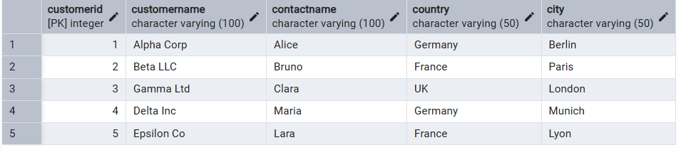
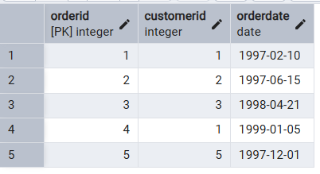
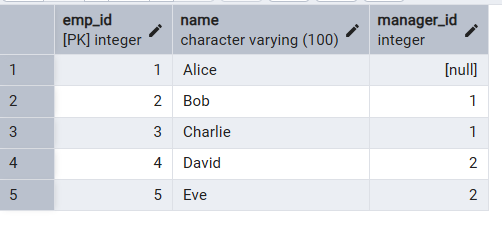

# Solution

## Tables:

1. Customers: <br/>


2. Orders:<br/>


3. Session_Employees:<br/>


### Query-a:

```sql
SELECT customerName, country
FROM Customers 
WHERE customerid IN (
	SELECT customerid 
	FROM Orders
	WHERE Extract(Year from orderdate) = 1997
)
```

### Result-a

| customername | country |
|--------------|---------|
| Alpha Corp   | Germany |
| Beta LLC     | France  |
| Epsilon Co   | France  |

### Query-b
```sql
SELECT customername,contactname, country
FROM Customers
WHERE country in ('Germany','France','UK')
AND contactname NOT LIKE '%a'
```

### Result-b

|"customername"|"contactname"|"country"|
|--------------|-------------|---------|
|"Alpha Corp"  |"Alice"   	 |"Germany"|
|"Beta LLC"	   |"Bruno"      |"France" |

### Query-c

```sql
SELECT *
FROM CUSTOMERS
ORDER BY country asc,city desc, customername asc;
```

### RESULT-c

| customerid | customername | contactname | country | city   |
|------------|--------------|-------------|---------|--------|
| 2          | Beta LLC     | Bruno       | France  | Paris  |
| 5          | Epsilon Co   | Lara        | France  | Lyon   |
| 4          | Delta Inc    | Maria       | Germany | Munich |
| 1          | Alpha Corp   | Alice       | Germany | Berlin |
| 3          | Gamma Ltd    | Clara       | UK      | London |

### QUERY-d
```sql
SELECT e.name as employee, m.name as manager
FROM session_employees e
LEFT JOIN session_employees m
ON m.emp_id = e.manager_id
```

### RESULT-d

| employee | manager |
|----------|---------|
| Alice    |         |
| Bob      | Alice   |
| Charlie  | Alice   |
| David    | Bob     |
| Eve      | Bob     |

### Query-e
```sql
SELECT e.name as employee, m.name as manager
FROM session_employees e
CROSS JOIN session_employees m
WHERE e.manager_id = m.emp_id
```

### Result-e


| employee | manager |
|----------|---------|
| Alice    |         |
| Bob      | Alice   |
| Charlie  | Alice   |
| David    | Bob     |
| Eve      | Bob     |
