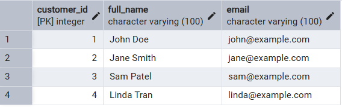

# Solution

## Tables:

1. session_customers <br/>



2. session_orders <br/>


## Query:
```sql
-- Retrieve the names and emails of customers who have placed orders above the average order total.
-- Calculate the Average Order Total: Use the session_orders table to compute the average of order_total.

SELECT AVG(order_total) as average_order
FROM session_orders

-- Filter Orders Above Average:
-- Identify orders that have an order_total greater than this calculated average.

SELECT order_id
FROM session_orders
Where order_total > (
	SELECT AVG(order_total)
	FROM session_orders
)

-- Link Orders to Customers:
-- Using either a subquery or a join, link the qualifying orders back to the corresponding customers in the session_customers table.

SELECT c.full_name, o.order_total
FROM session_customers c
JOIN session_orders o
ON c.customer_id = o.customer_id
Where o.order_total > (
	SELECT AVG(order_total)
	FROM session_orders
)
```

## Result

| full_name | order_total |
|-----------|-------------|
|Jane Smith |	320.00    |
|Jane Smith |	450.00    |