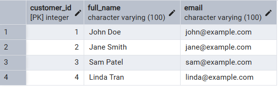
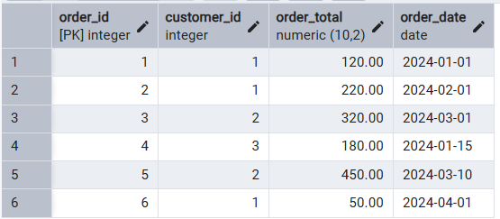

# SOultion

## Tables:

1. session_customers <br/>



2. session_orders <br/>



## Query

```sql

-- Ranking Orders:
-- Calculate the rank of each order based on order_total in descending order for each customer.

SELECT 
	customer_id,
	order_id,
	RANK() OVER (
		PARTITION BY customer_id
		ORDER BY order_total DESC
	) as order_rank
FROM session_orders

-- Showing full name insatead of cutomer_id
WITH rank_order AS (
	SELECT 
	customer_id,
	order_id,
	RANK() OVER (
		PARTITION BY customer_id
		ORDER BY order_total DESC
	) as order_rank
	FROM session_orders
)
SELECT c.full_name, r.order_id, r.order_rank
FROM session_customers c
JOIN rank_order r
ON c.customer_id = r.customer_id 


-- Alternate by collapsing the customer_id rows
WITH ranked_orders AS (
  SELECT 
    customer_id,
    order_id,
    RANK() OVER (
      PARTITION BY customer_id 
      ORDER BY order_total DESC
    ) AS order_rank
  FROM session_orders
)
SELECT 
  customer_id,
  STRING_AGG(
    'Order ID: ' || order_id || ' (Rank: ' || order_rank || ')',
    ', '
    ORDER BY order_rank
  ) AS ranked_orders_summary
FROM ranked_orders
GROUP BY customer_id;
```

```sql
-- Cumulative Sum:
-- Compute the cumulative sum of order_total for each customer, ordered by order_date.

SELECT
customer_id,
SUM(order_total) OVER (
	PARTITION BY customer_id
	ORDER BY order_date
) AS running_total
FROM session_orders

-- showing name instead of id
WITH total_run AS (
	SELECT
		customer_id,
		SUM(order_total) OVER (
			PARTITION BY customer_id
			ORDER BY order_date
		) AS running_total
	FROM session_orders
)
SELECT c.full_name, r.running_total
FROM session_customers c
JOIN total_run r
ON r.customer_id = c.customer_id

-- finding the max of cumulative total spend by each name
-- OR finding max worth of order for each name

WITH total_run AS (
	SELECT
		customer_id,
		SUM(order_total) OVER (
			PARTITION BY customer_id
			ORDER BY order_date
		) AS running_total
	FROM session_orders
)
SELECT c.full_name, MAX(r.running_total) as max_order
FROM session_customers c
JOIN total_run r
ON r.customer_id = c.customer_id
GROUP BY c.full_name
ORDER BY max_order
```

```sql
-- Moving Average:
-- Calculate the moving average of order_total for each customer using a sliding window
-- that includes the current row and the previous two orders.
WITH avg_run AS(
SELECT
    customer_id,
    order_id,
    ROUND(
        AVG(order_total) OVER (
            PARTITION BY customer_id
            ORDER BY order_id
            ROWS BETWEEN 
			2 PRECEDING AND CURRENT ROW
        ),
        2
    ) AS moving_avg
FROM session_orders
)
SELECT c.full_name, r.order_id, r.moving_avg
FROM session_customers c
JOIN avg_run r
ON c.customer_id = r.customer_id
```

## Result

a. <br/>
| customer_id | order_id | order_rank |
|-------------|----------|------------|
| 1           | 2        | 1          |
| 1           | 1        | 2          |
| 1           | 6        | 3          |
| 2           | 5        | 1          |
| 2           | 3        | 2          |
| 3           | 4        | 1          |

b. <br/>
| full_name   | running_total |
|-------------|---------------|
| John Doe    | 120.00        |
| John Doe    | 340.00        |
| John Doe    | 390.00        |
| Jane Smith  | 320.00        |
| Jane Smith  | 770.00        |
| Sam Patel   | 180.00        |


c. <br/>
| full_name   | order_id | moving_avg |
|-------------|----------|------------|
| John Doe    | 1        | 120.00     |
| John Doe    | 2        | 170.00     |
| John Doe    | 6        | 130.00     |
| Jane Smith  | 3        | 320.00     |
| Jane Smith  | 5        | 385.00     |
| Sam Patel   | 4        | 180.00     |
